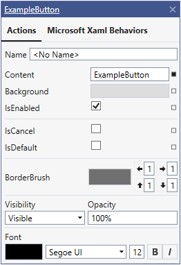
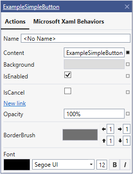

## Suggested Actions Extensibility

- [Tokens](./xaml-designer-suggested-actions-extensibility-tokens.md)
- [Features](./xaml-designer-suggested-actions-extensibility-features.md)
- [Behaviors](./xaml-designer-suggested-actions-extensibility-behaviors.md)
- [Customization](./xaml-designer-suggested-actions-extensibility-customization.md)

In Visual Studio 2019 16.7 Preview 3 we added extensibility support for "XAML Suggested Actions"
>*Note: this API will be available only in Preview Channel until feature is finalized and completed*

To enable "Xaml Suggested Actions" for any control, a `SuggestedActionProvider` feature provider should be created and registered in metadata.

>*A Control could have multiple Suggested Actions providers. Each provider will be shown as a separate tab in the Suggested Actions UI.*

Example:
```cs
public class ExampleButton : Button { }
```



### Implementation for example above:
```CS
public class ExampleButtonSuggestedActionProvider : SuggestedActionProvider
{
    public static ActionToken Token_Property_IsCancel = new ActionToken(0x1001);
    public static ActionToken Token_Property_IsDefault = new ActionToken(0x1002);
    public static ActionToken Token_Last = new ActionToken(0x10FF);
    public override string Header => "Actions";
    public override string Type => "CustomControlLibrary.WpfCore.ExampleButton";
    public override void Initialize()
    {
        this.ShowNameProperty = true;
        base.Initialize();
        
        this.AddGroup(new ActionGroup(SuggestedActionProviderTokens.Token_Group_Common,
            new PropertyAction(SuggestedActionProviderTokens.Token_Property_Content, "Content"),
            new PropertyAction(SuggestedActionProviderTokens.Token_Property_Background, "Background"),
            new PropertyAction(SuggestedActionProviderTokens.Token_Property_IsEnabled, "IsEnabled")
            ));
        
        this.AddGroup(new ActionGroup(SuggestedActionProviderTokens.Token_Group_Specific,
            new PropertyAction(ExampleButtonSuggestedActionProvider.Token_Property_IsCancel,"IsCancel"),
            new PropertyAction(ExampleButtonSuggestedActionProvider.Token_Property_IsDefault,"IsDefault")));
        
        this.AddGroup(new BorderBrushActionGroup());
        this.AddGroup(new VisibilityActionGroup());
        this.AddGroup(new FontSettingsActionGroup());
    }
}
```
### Example for inherited controls
```cs
public class ExampleSimpleButton : ExampleButton { }
```



```CS
public class ExampleSimpleButtonSuggestedActionProvider : ExampleButtonSuggestedActionProvider
{
    public static ActionToken Token_Property_CustomProp = ExampleButtonSuggestedActionProviderToken_Last + 1;
    public new static ActionToken Token_Last = new ActionToken(0x2FFF);
    public override string Type => "CustomControlLibrary.WpfCore.ExampleSimpleButton";
    public override void Initialize()
    {
        base.Initialize();
        //Hide Visibility Group
        this.GetGroupByToken(SuggestedActionProviderTokens.Token_Group_VisibilitySettings).IsVisible =false;
        
        //Hide IsDefault Property
        this.GetActionByToken(ExampleSimpleButtonSuggestedActionProvider.Token_Property_IsDefault)IsVisible = false;
        
        //Add new Opacity (without Token) property after IsDefault (even if it was hidden before)
        this.InsertAction(new PropertyAction("Opacity"), after:ExampleSimpleButtonSuggestedActionProvider.Token_Property_IsDefault);
        
        //Add new Link Action after IsDefault - will be inserted after IsDefault, but before Opacity
        this.InsertAction(new LinkAction("New link", () => { }), after:ExampleSimpleButtonSuggestedActionProvider.Token_Property_IsDefault);
        
        //Subscribe to ModelItem Property Changed Event to update view if needed
        this.ModelItemPropertyChanged +=ExampleSimpleButtonSuggestedActionProvider_ModelItemPropertyChanged;
    }
    
    private void ExampleSimpleButtonSuggestedActionProvider_ModelItemPropertyChanged(object sender,PropertyChangedEventArgs e)
    {
        
    }
}
```

### Metadata registration
```CS
...
//Add SuggestionsAttribute to enabled "XAML Suggested Actions for control"
builder.AddCustomAttributes("CustomControlLibrary.WpfCore.ExampleButton", new SuggestionsAttribute());

//Add one provider
builder.AddCustomAttributes("CustomControlLibrary.WpfCore.ExampleButton", new FeatureAttribute(typeof(ExampleButtonSuggestedActionProvider)));

//Same for another control
builder.AddCustomAttributes("CustomControlLibrary.WpfCore.ExampleSimpleButton", new SuggestionsAttribute());
builder.AddCustomAttributes("CustomControlLibrary.WpfCore.ExampleSimpleButton", new FeatureAttribute(typeof(ExampleSimpleButtonSuggestedActionProvider)));
...
```

### Documentation link


At the top of the Suggested Actions dialog in the designer there is a Type Name label.
It could be used as a hyperlink to documentation. To enabled it, specify `DocumentationAttribute` in Metadata:
```cs
builder.AddCustomAttributes("System.Windows.Controls.ComboBox", 
                            new DocumentationAttribute(helpLink: "https://docs.microsoft.com/en-us/dotnet/api/system.windows.controls.combobox"));
```
>*If `DocumentationAttribute` has not been added, hyperlink will open documentation for the first parent class that has this attribute, otherwise Type Name label will be static*